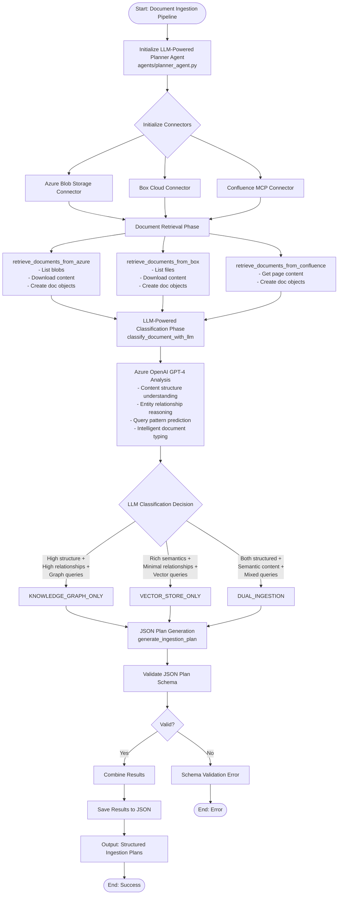

# Document Ingestion Pipeline - End-to-End Flow

## Overview

This document provides a comprehensive overview of the Document Classifier & Ingest Planner system's end-to-end workflow, from document retrieval through plan generation and execution.

## System Architecture

```
┌─────────────────┐    ┌─────────────────┐    ┌─────────────────┐
│  Azure Blob     │    │  Box Cloud      │    │  Confluence     │
│  Storage        │    │  Storage        │    │  MCP            │
└─────────────────┘    └─────────────────┘    └─────────────────┘
         │                       │                       │
         └───────────────────────┼───────────────────────┘
                                 │
                    ┌─────────────────────┐
                    │ LLM-Powered         │
                    │ Planner Agent       │
                    │ (Azure OpenAI)      │
                    └─────────────────────┘
                                 │
                    ┌─────────────────────┐
                    │ Document            │
                    │ Classification      │
                    │ Engine              │
                    └─────────────────────┘
                                 │
         ┌───────────────────────┼───────────────────────┐
         │                       │                       │
┌─────────────────┐    ┌─────────────────┐    ┌─────────────────┐
│ KNOWLEDGE_GRAPH │    │ VECTOR_STORE    │    │ DUAL_INGESTION  │
│ ONLY            │    │ ONLY            │    │                 │
└─────────────────┘    └─────────────────┘    └─────────────────┘
```

## Flow Diagram



## Detailed Process Flow

### Phase 1: System Initialization

#### 1.1 Environment Setup
```python
# Initialize LLM-Powered Planner Agent
from agents.planner_agent import LLMPlannerAgent

planner = LLMPlannerAgent(env_file=".env.dev")

# Load environment variables
# - Azure OpenAI credentials
# - Azure storage credentials
# - Box API credentials  
# - Confluence MCP configuration
```

#### 1.2 Connector Initialization
- **Azure Connector**: Blob storage client setup
- **Box Connector**: OAuth2 authentication setup
- **Confluence MCP Connector**: MCP protocol initialization

### Phase 2: Document Retrieval

#### 2.1 Azure Blob Storage
```python
def retrieve_documents_from_azure(self, container_name: str) -> List[Dict]:
    # List all blobs in container
    # Download blob content
    # Create document objects with metadata
    # Return structured document list
```

#### 2.2 Box Cloud Storage
```python
def retrieve_documents_from_box(self, folder_id: str) -> List[Dict]:
    # Authenticate with Box API
    # List files in folder
    # Download file content
    # Extract metadata
    # Return structured document list
```

#### 2.3 Confluence via MCP
```python
def retrieve_documents_from_confluence(self, space_key: str) -> List[Dict]:
    # Connect via MCP protocol
    # Get page content and metadata
    # Process Confluence-specific formatting
    # Return structured document list
```

### Phase 3: LLM-Powered Document Classification

#### 3.1 Azure OpenAI Integration
```python
async def classify_document_with_llm(self, content: str, doc_uri: str, 
                                   metadata: Optional[Dict] = None) -> Dict:
    """
    Use Azure OpenAI LLM to classify document and determine ingestion strategy.
    """
    if not self.is_llm_available():
        return self._fallback_classification(content, doc_uri, metadata)
    
    try:
        # Create intelligent classification prompt
        prompt = self._create_classification_prompt(content, doc_uri, metadata)
        
        # Get LLM analysis using Azure OpenAI GPT-4
        response = await self.llm_client.chat.completions.create(
            model=self.model_name,
            messages=[
                {"role": "system", "content": "You are an expert document classifier..."},
                {"role": "user", "content": prompt}
            ],
            temperature=0.1
        )
        
        # Parse and validate LLM response
        return self._parse_llm_response(response.choices[0].message.content)
        
    except Exception as e:
        self.logger.error(f"LLM classification failed: {e}")
        return self._fallback_classification(content, doc_uri, metadata)
```

#### 3.2 Intelligent Content Analysis
```python
def _create_classification_prompt(self, content: str, doc_uri: str, 
                                metadata: Optional[Dict] = None) -> str:
    """Create intelligent prompt for LLM-based classification."""
    
    # Extract document structure and entities using utilities
    structure_info = analyze_document_structure(content)
    entities = extract_entities(content)
    
    prompt = f"""
    Analyze this document and classify it for optimal ingestion strategy:
    
    Document URI: {doc_uri}
    Content Sample: {content[:2000]}...
    
    Structure Analysis: {structure_info}
    Entities Found: {entities[:10]}
    
    Based on the guidelines, classify as:
    1. KNOWLEDGE_GRAPH_ONLY - High structure + relationships
    2. VECTOR_STORE_ONLY - Rich semantics + minimal relationships  
    3. DUAL_INGESTION - Both structured and semantic value
    
    Respond with JSON format including reasoning.
    """
    return prompt
```

### Phase 4: Classification Decision

#### 4.1 LLM-Powered Classification Logic
```python
def _parse_llm_response(self, llm_response: str) -> Dict:
    """Parse LLM response and extract classification decision."""
    try:
        # Parse JSON response from LLM
        response_data = json.loads(llm_response)
        
        classification = response_data.get('classification', 'DUAL_INGESTION')
        confidence = response_data.get('confidence', 0.5)
        reasoning = response_data.get('reasoning', '')
        
        # Validate classification against known types
        valid_classifications = [
            'KNOWLEDGE_GRAPH_ONLY', 
            'VECTOR_STORE_ONLY', 
            'DUAL_INGESTION'
        ]
        
        if classification not in valid_classifications:
            classification = 'DUAL_INGESTION'  # Safe default
            
        return {
            'classification': classification,
            'confidence_score': confidence,
            'reasoning': reasoning,
            'llm_analysis': response_data
        }
        
    except Exception as e:
        self.logger.error(f"Failed to parse LLM response: {e}")
        return self._fallback_classification_result()

def _fallback_classification(self, content: str, doc_uri: str, 
                           metadata: Optional[Dict] = None) -> Dict:
    """Fallback to rule-based classification when LLM is unavailable."""
    
    # Use utility functions for basic analysis
    structure_info = analyze_document_structure(content)
    entities = extract_entities(content)
    
    # Simple rule-based classification
    if len(entities) > 10 and structure_info.get('has_sections', False):
        return {
            'classification': 'DUAL_INGESTION',
            'confidence_score': 0.7,
            'reasoning': 'Fallback: High entity count + structured content',
            'fallback_used': True
        }
    elif len(entities) < 5:
        return {
            'classification': 'VECTOR_STORE_ONLY',
            'confidence_score': 0.6,
            'reasoning': 'Fallback: Low entity count, likely narrative content',
            'fallback_used': True
        }
    else:
        return {
            'classification': 'KNOWLEDGE_GRAPH_ONLY',
            'confidence_score': 0.5,
            'reasoning': 'Fallback: Medium entity count, structured content',
            'fallback_used': True
        }
```

#### 4.2 Document Type Examples

##### KNOWLEDGE_GRAPH_ONLY
- Organizational charts
- Technical specifications
- Academic curriculum structures
- Regulatory frameworks
- API documentation with dependencies

##### VECTOR_STORE_ONLY  
- Research papers
- News articles
- Product descriptions
- User manuals
- Marketing content

##### DUAL_INGESTION
- Medical literature (entities + semantics)
- Legal case law (citations + content)
- Technical documentation (structure + descriptions)
- Scientific journals (relationships + research content)

### Phase 5: Plan Generation

#### 5.1 Graph-Only Plan
```json
{
  "plan_id": "uuid-graph-only",
  "classification": "KNOWLEDGE_GRAPH_ONLY",
  "confidence_score": 0.85,
  "steps": [
    {
      "task_id": "1",
      "tool": "graph_ingestion",
      "args": {
        "doc_uri": "azure://container/doc.pdf",
        "extraction_mode": "entities_and_relationships",
        "graph_schema": "enterprise_knowledge"
      },
      "depends_on": []
    }
  ]
}
```

#### 5.2 Vector-Only Plan
```json
{
  "plan_id": "uuid-vector-only", 
  "classification": "VECTOR_STORE_ONLY",
  "confidence_score": 0.92,
  "steps": [
    {
      "task_id": "1",
      "tool": "vector_ingestion",
      "args": {
        "doc_uri": "box://file/123",
        "chunking_strategy": "semantic",
        "embedding_model": "text-embedding-ada-002"
      },
      "depends_on": []
    }
  ]
}
```

#### 5.3 Dual Ingestion Plan
```json
{
  "plan_id": "uuid-dual",
  "classification": "DUAL_INGESTION", 
  "confidence_score": 0.78,
  "steps": [
    {
      "task_id": "1",
      "tool": "vector_ingestion",
      "args": {
        "doc_uri": "confluence-mcp://page_title",
        "chunking_strategy": "hybrid",
        "embedding_model": "text-embedding-ada-002"
      },
      "depends_on": []
    },
    {
      "task_id": "2", 
      "tool": "graph_ingestion",
      "args": {
        "doc_uri": "confluence-mcp://page_title",
        "extraction_mode": "entities_and_relationships",
        "graph_schema": "confluence_knowledge"
      },
      "depends_on": ["1"]
    }
  ]
}
```

### Phase 6: Validation & Output

#### 6.1 JSON Schema Validation
```python
def validate_json_plan(plan: Dict) -> bool:
    required_fields = ['plan_id', 'classification', 'confidence_score', 'steps']
    step_fields = ['task_id', 'tool', 'args', 'depends_on']
    
    # Validate plan structure
    # Validate step dependencies
    # Validate tool arguments
    # Return validation result
```

#### 6.2 Results Compilation
```python
def combine_results(classification_result: Dict, ingestion_plan: Dict) -> Dict:
    return {
        'classification': classification_result,
        'ingestion_plan': ingestion_plan,
        'metadata': {
            'processed_at': datetime.now().isoformat(),
            'pipeline_version': '1.0.0',
            'confidence_score': classification_result['confidence_score']
        }
    }
```

#### 6.3 Output Storage
```python
def save_results(results: Dict, output_file: str = "ingestion_plans.json"):
    save_json(results, output_file)  # From utils/common_function.py
    logger.info(f"Ingestion plans saved to {output_file}")
```

## Key Components

### Core Classes

#### LLMPlannerAgent (agents/planner_agent.py)
- `classify_document_with_llm()`: Azure OpenAI-powered document classification
- `generate_ingestion_plan()`: Creates JSON ingestion plans
- `retrieve_documents()`: Multi-connector document retrieval
- `_create_classification_prompt()`: Intelligent prompt engineering
- `_parse_llm_response()`: LLM response parsing and validation
- `_fallback_classification()`: Rule-based fallback when LLM unavailable

#### ConnectorManager (within LLMPlannerAgent)
- `_initialize_azure_connector()`: Azure Blob Storage integration
- `_initialize_box_connector()`: Box Cloud Storage integration  
- `_initialize_confluence_connector()`: Confluence MCP integration
- `get_available_connectors()`: Dynamic connector availability check

### Utility Functions (utils/common_function.py)
- `generate_uuid()`: Generate unique plan identifiers
- `extract_entities()`: Entity extraction from content
- `analyze_document_structure()`: Structure analysis utilities
- `validate_json_plan()`: Plan validation
- `save_json()`: Results persistence

## Configuration

### Environment Variables
```bash
# Azure OpenAI (Primary Classification Engine)
AZURE_OPENAI_API_KEY=your_azure_openai_key
AZURE_OPENAI_ENDPOINT=https://your-resource.openai.azure.com/
AZURE_OPENAI_API_VERSION=2024-02-01
AZURE_OPENAI_DEPLOYMENT_NAME=gpt-4

# Azure Storage
AZURE_STORAGE_CONNECTION_STRING=DefaultEndpointsProtocol=https;...
AZURE_STORAGE_ACCOUNT_NAME=yourstorageaccount

# Box API
BOX_CLIENT_ID=your_box_client_id
BOX_CLIENT_SECRET=your_box_client_secret

# Confluence MCP
CONFLUENCE_MCP_SERVER_URL=http://localhost:3000
CONFLUENCE_MCP_API_TOKEN=your_confluence_token
```

### Guidelines Integration
The system follows the classification rules defined in `doc/guidelines.md`:
- Content structure assessment criteria
- Entity relationship thresholds
- Query pattern indicators
- Document type mappings

## Error Handling

### Common Error Scenarios
1. **Connector Authentication Failures**: Graceful fallback and retry logic
2. **Document Format Issues**: Content parsing error handling
3. **Classification Ambiguity**: Default to DUAL_INGESTION with low confidence
4. **Schema Validation Failures**: Detailed error reporting and plan correction

### Logging Strategy
- INFO: Process milestones and successful operations
- WARNING: Non-critical issues and fallback activations  
- ERROR: Critical failures requiring intervention
- DEBUG: Detailed classification decision factors

## Performance Considerations

### Optimization Strategies
- **Batch Processing**: Process multiple documents in parallel
- **Caching**: Cache connector authentication and document metadata
- **Streaming**: Stream large document content to avoid memory issues
- **Async Processing**: Use async/await for I/O-bound operations

### Scalability Metrics
- Documents processed per minute
- Classification accuracy rates
- Plan generation latency
- Memory usage per document

## Integration Points

### Upstream Systems
- Azure Blob Storage containers
- Box folder structures
- Confluence spaces and pages

### Downstream Consumers
- Execution agents for plan implementation
- Vector store ingestion pipelines
- Knowledge graph construction services
- Monitoring and analytics systems

## Monitoring & Observability

### Key Metrics
- Classification distribution (Graph/Vector/Dual percentages)
- Confidence score distributions
- Processing latency by document type
- Error rates by connector

### Health Checks
- Connector availability
- Classification service responsiveness
- Plan validation success rates
- Output file generation

---

*This document provides the complete end-to-end flow of the LLM-Powered Document Classifier & Ingest Planner system. For implementation details, refer to the source code in `agents/planner_agent.py` and related modules.*
